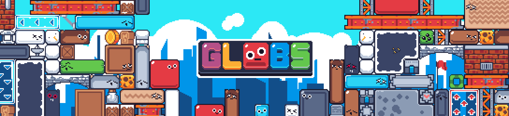
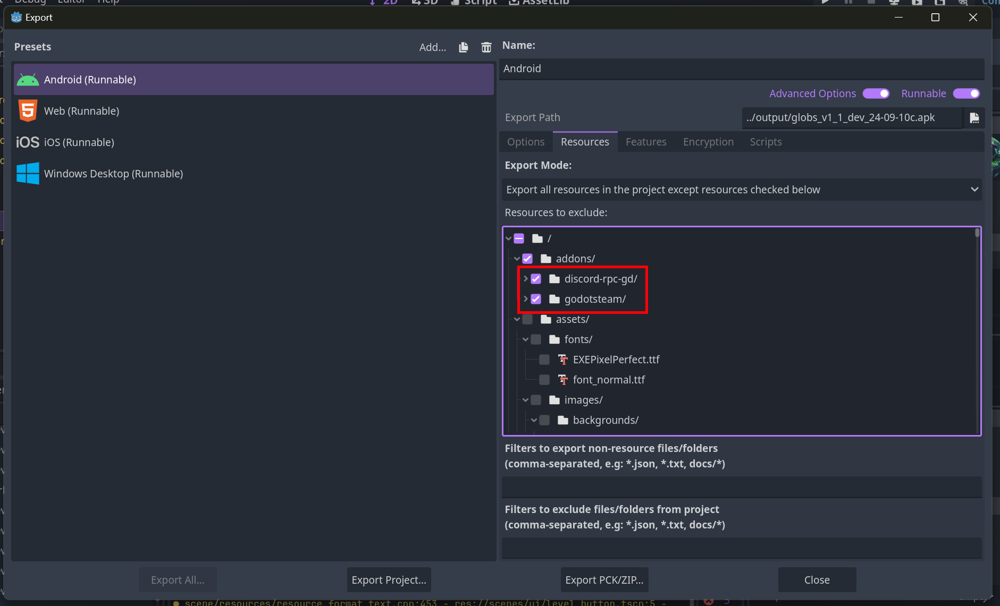

# Globs

[**Google Play**](https://play.google.com/store/apps/details?id=com.yolwoocle.globs) · [**Steam**](https://s.team/a/3219110) · [**itch.io**](https://yolwoocle.itch.io/globs) · [**GitHub**](https://github.com/ARKANYOTA/gmtk2024/) · [**Releases**](https://github.com/ARKANYOTA/gmtk2024/releases)

Meet the size-changing Globs in this colorful puzzle game. Use the curious properties of their bodies at your advantage to solve a variety of puzzles, all in a expressive pixel art aesthetic and upbeat soundtrack.

This game was made using the [Godot game engine](https://godotengine.org), originally in 96 hours for the [GMTK Game Jam 2024](https://itch.io/jam/gmtk-2024) based on the theme "Built to Scale", but we continued working on it afterwards. 

<h2>
    
        
     Is this game open source?
</h2>

**No.** In contrast to [open source software](https://en.wikipedia.org/wiki/Open-source_software), this game is only [source available](https://en.wikipedia.org/wiki/Source-available_software). **Not having a licence means that by default we reserve all original rights for the game, even if the code is public.**  

However, we are very lax with what you can do with the source code. This is just to legally cover our asses from people that reupload games without our consent. 

### Examples of things that ARE okay:
- Reusing some sprites or small bits of code (functions, classes, Godot nodes...) in your games, even commercial, and crediting us.
- Forking this repo and making your own mods, as long as you are not profiting from them.
- Writing reviews, or sharing screenshots and videos online.
- Linking to the page of this repo or its official links.

*This does not mean that we are giving up any rights, by the way; this is purely indicative.*

### Examples of things that are NOT okay:
- Taking any pre-existing or self-built executables, with no or minor modifications, or a major part of the source code, and reuploading it to other places, whether you are directly or indirectly profiting from it or not.
- We just don't like what you are doing. (e.g., AI-powered NFT crypto trading cards)

If you have any doubts please contact us at `ninesliced@gmail.com`. (I don't bite! :) -Léo)

<h2>
    
        
     Running, exporting, and contributing
</h2>

Install [Godot](https://godotengine.org/) (preferably version 4.3, which is the version this was designed for).  
Open the `src` folder in the Godot project manager.

To export, look at the [Godot documentation page](https://docs.godotengine.org/en/stable/tutorials/export/exporting_projects.html) about exporting projects.  
**IMPORTANT**: For Android builds, when exporting, please select the export mode to "Export all resources in the project except resourced checked below", and disable `discord-rpc-gd` and `godotsteam`. (In general, the game is designed to work with any of the extensions disabled.)

If you wish to contribute, you can [open an issue](https://github.com/ARKANYOTA/globs/issues) or [create a pull request](https://github.com/ARKANYOTA/globs/pulls). 

If you run into any issues, you can [contact us](https://ninesliced.github.io/#contact).

<h2>
    
        
     Participants
</h2>

- [`ArkanYota`](https://github.com/arkanyota) · code
- [`Artichaut`](https://github.com/LeSeulArtichaut) · emotional support
- [`NotGoyome`](https://github.com/notgoyome) · code, art
- [`Strochnis`](https://on.soundcloud.com/wk1kdJsHbH2m8tLZ8) · music
- [`Theobosse`](https://github.com/TheodoreBillotte) · code
- [`Yolwoocle`](https://github.com/Yolwoocle) · code, art

Assets used: 

- [Kenney](https://kenney.nl)
- Floraphonic (freesound)
- [Pixel Planet Generator by Deep-Fold](https://deep-fold.itch.io/pixel-planet-generator)

&copy; 2024 Guillaume Tran, Léo Bernard, Nolan Carlisi, Théodore Billotte. All rights reserved.
